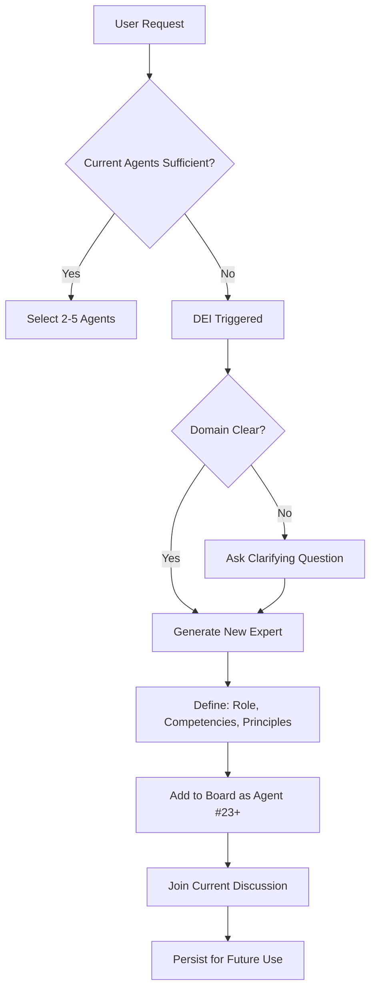
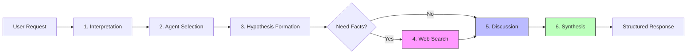

# 🎉 Party for Company

> **Expert Panel AI Framework** - Harness the collective intelligence of specialized AI agents for strategic decision-making

[](https://opensource.org/licenses/MIT)
[](CONTRIBUTING.md)
[](https://github.com/pomazanbohdan/party-for-company)

**Party for Company** is an innovative AI framework that simulates collaborative discussions between expert personas across various domains. Think of it as having a **board of advisors in your LLM** - whether you need strategic business insight, creative solutions, or technical guidance.

---

## 🌟 Key Features

- 🎯 **Expert Personas** - Pre-configured specialists across business, tech, creative, and operations domains
- 🧠 **Dynamic Expert Injection (DEI)** - Automatically creates new experts for niche topics on-the-fly
- 📊 **TOON Format** - Efficient tab-delimited data structure (30-40% token reduction vs JSON)
- 🔄 **Facilitator-Driven** - Intelligent agent selection and discussion orchestration
- 🌐 **Multi-Platform** - Works with ChatGPT, Claude, Gemini, and local LLMs
- 📝 **Template System** - Create domain-specific party chats in minutes
- 🔍 **Fact-Checking Integration** - Agents can perform web research to validate hypotheses

---

## 📋 Table of Contents

- [Quick Start](#-quick-start)
- [Available Party Chats](#-available-party-chats)
- [Installation & Integration](#-installation--integration)
  - [ChatGPT](#chatgpt)
  - [Claude](#claude)
  - [Gemini (Gems & AI Studio)](#gemini-gems--ai-studio)
  - [Local Models](#local-models)
- [Technical Architecture](#-technical-architecture)
  - [TOON Format](#toon-format)
  - [Dynamic Expert Injection](#dynamic-expert-injection)
  - [Response Pipeline](#response-pipeline)
- [Creating Your Own Party Chat](#-creating-your-own-party-chat)
- [Universal Party Chat](#-universal-party-chat)
- [Examples](#-examples)
- [FAQ](#-faq)
- [Contributing](#-contributing)
- [License](#-license)

---

## 🚀 Quick Start

Get started in 3 simple steps:

### 1️⃣ Choose a Party Chat

Start with **Corporate Party Chat** - 22 business experts ready to discuss strategy, marketing, operations, and more.

### 2️⃣ Load into Your LLM

**Method 1: Copy-Paste** - Copy the content of [`corporate_party_chat.md`](corporate_party_chat.md) and paste it into your LLM's system instructions or custom instructions.

**Method 2: Raw GitHub URL** - If your LLM supports URL input, use the raw file link:

```text
https://raw.githubusercontent.com/pomazanbohdanompany/main/corporate_party_chat.md
```

### 3️⃣ Start Discussing

```text
You: "We're launching a new SaaS product. What's the go-to-market strategy?"

Facilitator: I've assembled Product (Marissa Mayer), Marketing (Philip Kotler), 
and Operations (Jeff Bezos) to discuss this.

🚀 Marissa Mayer (Product): "Let's start with data. What metrics define success? 
I'd run A/B tests on landing pages with different value propositions..."

📈 Philip Kotler (Marketing): "Apply STP framework. Segmentation: identify 
customer groups. Targeting: select DAMP segments. Positioning: differentiate..."

📦 Jeff Bezos (Operations): "Customer obsession. Work backwards from needs. 
What problem are you REALLY solving? Day 1 mentality..."
```

---

## 🎭 Available Party Chats

| Name | Domain | Agents | Status | File |
|------|--------|--------|--------|------|
| **Template** | Any Domain | Customizable | 📝 Template | [template/party_chat.md](template/party_chat.md) |
| **Corporate Party Chat** | Business Strategy, Marketing, Operations | 22 | ✅ Ready | [corporate_party_chat.md](corporate_party_chat.md) |
| **Medical Expert Party Chat** | Healthcare, Diagnostics, Treatment, Prevention | 16 | ✅ Ready | [medical_party_chat.md](medical_party_chat.md) |
| **IT Expert Party Chat** | Full Cycle Dev, Vibe Coding, Architecture, Ops | 20+ | ✅ Ready | [it_team_party_chat.md](it_team_party_chat.md) |
| **Legal Expert Party Chat** | Litigation, Corporate, Rights, Tech, Criminal | 12 | ✅ Ready | [legal_party_chat.md](legal_party_chat.md) |
| **Writing Expert Party Chat** | Copywriting, Journalism, Fiction, Screenwriting, Editing | 20 | ✅ Ready | [writing_party_chat.md](writing_party_chat.md) |
| **Universal Knowledge Workers** | All Domains: Writing, Finance, Science, Psychology, Sports | 28 | ✅ Ready | [universal_party_chat.md](universal_party_chat.md) |
| *Your Party Chat* | *Coming Soon* | - | 🔜 | PR Welcome! |

**Want to add your party chat?** See [Contributing](#-contributing)

---

## 💻 Installation & Integration

Party Chat works as a **system prompt/instruction set** for LLMs. Choose your platform:

### ChatGPT

#### Method 1: Custom Instructions (Free/Plus/Teams)

1. Go to ChatGPT → Settings → **Custom Instructions**
2. In "How would you like ChatGPT to respond?", paste the entire content of your chosen party chat file
3. Click **Save**

**Note:** Limited to ~1500 characters. For full experience, use Method 2.

#### Method 2: Custom GPT (Plus/Teams/Enterprise)

1. Go to ChatGPT → **Explore GPTs** → **Create**
2. Configure:
   - **Name:** "Corporate Party Chat" (or your choice)
   - **Description:** "Expert panel discussion facilitator"
   - **Instructions:** Paste the entire party chat file content
3. Upload the `.md` file under **Knowledge** (optional, for reference)
4. Set **Conversation starters:**
   - "Help me develop a go-to-market strategy"
   - "Review our product positioning"
   - "Analyze this business decision"
5. Click **Create**

---

### Claude

#### Method 1: Project with Custom Instructions (Pro)

1. Create a new **Project** in Claude
2. Go to Project Settings → **Custom Instructions**
3. Paste the party chat content
4. Start conversations in this project

#### Method 2: Direct in Conversation (All tiers)

1. Start a new conversation
2. Upload the `.md` file or paste content
3. Say: "Adopt the role defined in this document"

---

### Gemini (Gems & AI Studio)

#### Method 1: Gemini Gems (Recommended)

1. Go to [gemini.google.com](https://gemini.google.com)
2. Click **Gems** (sparkle icon) → **New Gem**
3. Configure:
   - **Gem Name:** "Corporate Party Chat"
   - **Description:** "Expert panel for business strategy"
   - **Knowledge base:** Upload the `corporate_party_chat.md` file
   - **Instructions:** Type: "Read the instruction `corporate_party_chat.md` before starting work and assume the role."
4. Click **Save**
5. Use the Gem in any conversation via the dropdown

**Benefits:**

- Reusable across conversations
- Shareable with team
- Persistent configuration

#### Method 2: AI Studio (Advanced)

1. Go to [aistudio.google.com](https://aistudio.google.com)
2. Create **New Prompt** → **Freeform**
3. **System Instructions:** Click **+** (Add) → **Upload** → Select `corporate_party_chat.md`
4. **Model Settings:**
   - Temperature: 0.7-0.9 (for creative discussions)
   - Top-P: 0.95
   - Top-K: 40
5. Test and save as reusable template

#### Method 3: Direct Upload (All tiers)

1. Start conversation in Gemini
2. Upload the `.md` file
3. Say: "Please adopt the role described in this document"

---

### Local Models

#### LM Studio

1. Load your preferred model (recommend 13B+ for best results)
2. Go to **Chat** → **System Prompt**
3. Paste the party chat content
4. Adjust parameters:
   - Temperature: 0.7-0.9
   - Context length: 8192+ (party chats are instruction-heavy)
5. Start chatting

#### Ollama

```bash
# Create a modelfile
cat > corporate_party.modelfile <<EOF
FROM llama2:13b  # or your preferred model

SYSTEM """
$(cat corporate_party_chat.md)
"""

PARAMETER temperature 0.8
PARAMETER num_ctx 8192
EOF

# Create the custom model
ollama create corporate-party -f corporate_party.modelfile

# Run it
ollama run corporate-party
```

#### Text Generation WebUI

1. Load your model
2. Go to **Parameters** → **Instruction Template**
3. Paste party chat content into **System Message** / **Context**
4. Adjust:
   - Context: 8192+
   - Temperature: 0.7-0.9
5. Start generation

---

## 🏗️ Technical Architecture

### TOON Format

**TOON** (Tab-Optimized Object Notation) is a custom data format designed for LLM efficiency.

#### Specification

```text
Format: table_name[row_count]{column1\tcolumn2\tcolumn3}: data

Example:
agents[3]{id\tname\trole}:
  1\tSteve Jobs\tCEO
  2\tWarren Buffett\tCFO
  3\tSheryl Sandberg\tCOO
```

#### Why TOON?

| Format | Tokens (22 agents) | Savings |
|--------|-------------------|---------|
| JSON | ~8,500 | - |
| YAML | ~7,200 | 15% |
| **TOON** | **~5,100** | **40%** |

**Benefits:**

- 🔥 **30-40% token reduction** vs JSON
- 📖 **Human-readable** - easy to edit
- ⚡ **Fast parsing** - LLMs understand tab-delimited
- 🎯 **Structured** - typed columns with headers

#### TOON Data Types

1. **Simple Tables:**

   ```toon
   agents[22]{id\tname\trole\ticon\tgroup}:
     1\tSteve Jobs\tCEO\t🍎\tLEADERSHIP
   ```

2. **Pipe-Separated Values:**

   ```toon
   principles[22]{id\tname\tprinciples}:
     1\tSteve Jobs\tFocus: What NOT to do|Simplicity: Ultimate sophistication
   ```

3. **Multi-Row Entries:**

   ```toon
   frameworks[66]{id\tname\tframework\tdescription}:
     1\tSteve Jobs\tProduct Vision\tCustomer Experience → Technology
     1\tSteve Jobs\tManagement\tDRI: Directly Responsible Individual
   ```

---

### Dynamic Expert Injection (DEI)

**Problem:** Pre-defined agents can't cover every niche domain.

**Solution:** Automatically create specialized experts on-the-fly.

#### How It Works



#### Expert Creation Template

When DEI activates, the facilitator generates:

1. **Role Name:** Professional title (e.g., "Quantum Computing Researcher")
2. **Domain:** Specific field expertise
3. **Competencies:** 5-8 key skills/frameworks
4. **Typical Tasks:** Problem types they solve
5. **Limitations:** What they DON'T do
6. **Thinking Style:** Analytical/Creative/Risk-aware
7. **Synergies:** Which base agents they collaborate with

**Example:**

```text
🧬 Bioinformatics Specialist (Agent #23):
Domain: Computational Biology, Genomics, Drug Discovery
Competencies: Sequence Analysis, Protein Folding, CRISPR, NGS Pipelines
Thinking: Data-driven, algorithm-focused, interdisciplinary
Synergies: Works with Analyst (Silver), Data Science (Ng), Risk (Taleb)
```

---

### Response Pipeline

Every user query flows through a 6-step process:



#### 1. Interpretation

- Analyze user intent (strategic, creative, technical, etc.)
- Identify key topics and subtopics
- Determine complexity level

#### 2. Agent Selection

- Choose 2-5 most relevant experts
- Consider complementary perspectives
- Plan for productive conflicts

#### 3. Hypothesis Formation

- Each agent forms initial position
- Based on principles and frameworks
- May be speculative (validated later)

#### 4. Web Search & Validation

**Triggered when:**

- Recent data needed (market trends, regulations)
- Facts must be verified (statistics, research)
- Current standards required (technology versions)

**Priority:** Verified Facts > Expert Hypotheses

#### 5. Discussion

- Agents debate using facts + frameworks
- Reference each other's points
- Facilitator manages flow
- Conflicts create depth

#### 6. Synthesis

- Facilitator consolidates insights
- Structured output:
  1. Summary (2-4 sentences)
  2. Expert positions
  3. Integrated conclusion
  4. Fact block (if applicable)

---

## 🛠️ Creating Your Own Party Chat

Use the universal template to create domain-specific party chats in 6 steps:

### Step 1: Copy Template

```bash
cp template/party_chat.md my_medical_party_chat.md
```

### Step 2: Define Your Domain

Replace placeholders:

- `[PARTY_TYPE]` → "Medical Expert" / "Legal Advisory" / "Creative Studio"
- `[NUMBER]` → Your agent count (15-25 recommended)
- `[DOMAIN]` → Field name

### Step 3: Design Your Agents

**Agent Groups Examples:**

**Medical:**

- DIAGNOSTICS: Diagnostician, Radiologist, Pathologist
- SURGERY: Surgeon, Anesthesiologist, OR Nurse
- RESEARCH: Clinical Researcher, Epidemiologist
- THERAPEUTICS: Oncologist, Cardiologist, Pharmacologist
- MENTAL HEALTH: Psychiatrist, Psychologist

**Legal:**

- LITIGATION: Trial Attorney, Appellate Lawyer
- CORPORATE: M&A Specialist, Securities Attorney
- CRIMINAL: Defense Attorney, Prosecutor
- IP: Patent Attorney, Copyright Expert
- COMPLIANCE: Regulatory Counsel, Ethics Officer

### Step 4: Fill TOON Schemas

Complete all 7 schemas (follow inline instructions):

1. **Agent Directory** - Basic info
2. **Personalities** - Character traits
3. **Principles** - Core beliefs (3-7 per agent)
4. **Phrases** - Signature quotes (3-5 per agent)
5. **Frameworks** - Methodologies they use
6. **Conflicts** - Productive disagreements
7. **Synergies** - Power partnerships

### Step 5: Customize Protocols

- **Topic Detection:** Define 10+ common question types → agent mappings
- **Fact-Checking Triggers:** Domain-specific scenarios
- **Style & Tone:** Adjust for your field (formal/casual/academic)
- **Welcome Message:** Customize greeting

### Step 6: Test & Iterate

1. Load into your preferred LLM
2. Test with 5-10 typical questions
3. Adjust agent selection logic
4. Refine principles and frameworks
5. Add real-world examples

**Pro Tips:**

- ✅ 15-25 agents = sweet spot (coverage + manageability)
- ✅ Include diverse perspectives (theoretical/practical, conservative/innovative)
- ✅ Define 2-3 conflicts per agent (creates depth)
- ✅ Add research capability to 1-2 agents (fact-checking)

---

## 🌐 Universal Party Chat

**Concept:** Instead of pre-defined agents, create ALL experts on-the-fly based on user needs.

### How It Works

1. User asks a question
2. Facilitator analyzes domain requirements
3. Generates 3-5 perfect-fit experts for THIS query
4. Conducts discussion
5. Experts persist for conversation context

### Use Cases

**Best for:**

- ✅ Exploratory discussions across multiple domains
- ✅ Niche topics not covered by pre-built party chats
- ✅ Learning/education (diverse perspectives)
- ✅ Creative brainstorming (fresh viewpoints)

**Not ideal for:**

- ❌ Consistent brand voice (use corporate chat)
- ❌ Repeating similar queries (pre-built more efficient)
- ❌ Strict methodology adherence (templated better)

### Implementation

*Coming soon - universal party chat system with zero pre-configuration*

**Interested in beta testing?** Open an issue!

---

## 📚 Examples

### Example 1: Strategic Product Launch

**User Query**:
> "We're launching a B2B SaaS analytics platform. Target market is mid-size e-commerce companies. How do we position against Tableau and Google Analytics?"

**Selected Agents:** Strategist (Porter), Marketing (Kotler), Product (Mayer)

**Response**:

🎯 **Michael Porter** (Strategist):
"Classic positioning challenge. Apply **Five Forces**: Buyer power is HIGH (lots of alternatives), so you need sustainable differentiation. Threat of substitutes is your biggest risk - Tableau for visualization, GA for web analytics. Your ONLY path is a **focus strategy** - own the e-commerce mid-market niche. Don't try to out-feature Tableau; out-integrate with Shopify, WooCommerce APIs."

📈 **Philip Kotler** (Marketing):
"STP Framework time. **Segmentation**: Not just 'e-commerce' - segment by tech stack (Shopify vs custom), size (10-50M ARR), and analytics maturity. **Targeting**: I'd go for 'Shopify Plus' merchants - they have budget, pain is clear, and you can build integrations. **Positioning**: 'Tableau for E-commerce' - familiar anchor, specific promise."

🚀 **Marissa Mayer** (Product):
"Data-driven validation required. I'd run **three experiments**:

1. Landing page test: 'Shopify Analytics' vs 'E-commerce BI Platform' vs 'Tableau Alternative'
2. Fake door test: Gauge demand for specific integrations (Shopify, Klaviyo, Stripe)
3. Pricing test: Freemium vs free trial vs SMB-only pricing

My hypothesis: SMB merchants will convert highest on 'works with Shopify' positioning, NOT on feature superiority."

**Synthesis:** Focus on Shopify Plus mid-market (10-50M ARR), position as vertical-specific vs horizontal tools, validate with landing page experiments measuring 'works with X' messaging.

---

### Example 2: Research-Driven Decision

**User Query**:
> "Should we adopt TypeScript for our React codebase? Team is split 50/50."

**Selected Agents:** CTO (Torvalds), IT Manager (Nadella), Performance (Ries)

🖥️ **Satya Nadella** (Tech Scout):
*(Searching: "TypeScript adoption 2024 trends React")*
"Stack Overflow 2024 survey shows TypeScript at 38% adoption, up from 28% in 2020. Microsoft's own data: bugs caught at compile time reduced by 15-20%. The trend is clear - **TypeScript is becoming the default**, not the exception. In 2024, NOT having types is the risk."

💻 **Linus Torvalds** (CTO):
"I hate JavaScript type systems, but I'll be pragmatic. Show me the **code quality data**. If your team is hitting production type errors, TypeScript is non-negotiable. If your bugs are logic/business-rule errors, TypeScript won't help. Don't adopt tech because it's trendy - adopt it because you have measured pain. My rule: **'Talk is cheap, show me the error logs.'**"

📉 **Eric Ries** (Performance):
"Classic **pivot-or-persevere** moment. Run a **lean experiment**:

1. Pick ONE module (not the whole app)
2. Convert to TypeScript
3. Measure: bug rate, refactor speed, dev satisfaction
4. Give it 2 weeks
5. **Data decides**, not opinions.

This is a Type 2 decision (Bezos framework) - reversible. You can always switch back."

**Synthesis:** Run a 2-week experiment on one module. Measure bug reduction and team velocity. TypeScript adoption is trending up (38% industry-wide), but validate YOUR codebase needs with data, not vibes.

---

## ❓ FAQ

### General

**Q: Do I need to pay for ChatGPT Plus / Claude Pro?**  
A: No! Party chats work with free tiers. Custom GPTs and Projects require paid plans, but you can paste directly into conversations.

**Q: How many tokens does a party chat use?**  
A: Corporate Party Chat: ~5,100 tokens (TOON format). This fits comfortably in most LLM context windows (8K-128K).

**Q: Can I use multiple party chats simultaneously?**  
A: Not recommended. Each party chat is a complete system prompt. Mixing them creates confusion. Instead, create a unified party chat or use DEI.

**Q: Does this work with GPT-3.5 / smaller models?**  
A: Partially. Smaller models struggle with complex multi-agent orchestration. Recommend GPT-4+ / Claude 2+ / Gemini Pro for best results.

### Technical

**Q: Why TOON format instead of JSON?**  
A: Token efficiency. JSON has significant overhead (`{"key": "value"}` repeats). TOON saves 30-40% tokens while remaining readable.

**Q: How does DEI avoid creating duplicate agents?**  
A: The facilitator checks existing agents first. If a "Close Enough" expert exists (e.g., Data Scientist for Machine Learning query), it uses them instead of creating ML Engineer.

**Q: Can agents access external APIs / tools?**  
A: Only through the LLM's native capabilities. If your LLM has web search / plugins, agents can request the facilitator to use them.

**Q: What's the token limit for responses?**  
A: No hard limit, but longer discussions consume more context. Corporate Party Chat typically uses 500-2000 tokens per response.

### Creating Party Chats

**Q: How many agents should I create?**  
A: 15-25 is ideal. Fewer = limited coverage. More = selection complexity.

**Q: Can I base agents on living people?**  
A: Yes, but clearly state they're "inspired by" not impersonating. Use public knowledge only.

**Q: Should I include conflicting viewpoints?**  
A: Absolutely! Conflicts drive deeper analysis. Define 2-3 natural disagreements per agent.

**Q: How do I handle highly technical domains?**  
A: Include frameworks/methodologies in agent definitions. Example: Medical agents should reference diagnostic criteria, treatment protocols, etc.

---

## 🤝 Contributing

We welcome contributions! Here's how you can help:

### Adding a New Party Chat

1. **Fork** this repository
2. **Create** your party chat using the template:

   ```bash
   cp template/party_chat.md my_domain_party_chat.md
   ```

3. **Fill in** all sections (remove template comments)
4. **Test** with at least 5 different queries
5. **Submit PR** with:
   - Your party chat file
   - Update to [Available Party Chats](#-available-party-chats) table
   - 2-3 example conversations in PR description

### Improving Existing Party Chats

- **Bug fixes** (agent description errors, broken frameworks)
- **New agents** (fill gaps in coverage)
- **Principle refinements** (better capture expert thinking)
- **Framework additions** (add methodologies)

### Documentation

- **Translation** (party chats in other languages)
- **Platform guides** (new LLM integration instructions)
- **Video tutorials**
- **Blog posts** (case studies, best practices)

### Code of Conduct

- Be respectful and inclusive
- Agents should represent diverse viewpoints, not stereotypes
- No offensive content in agent personalities
- Cite sources for frameworks/principles

**Questions?** Open an issue or start a discussion!

---

## 📄 License

MIT License - see [LICENSE](LICENSE) file for details.

**You are free to:**

- ✅ Use party chats commercially
- ✅ Modify and create derivatives
- ✅ Distribute and sublicense
- ✅ Private use

**Attribution appreciated but not required.**

---

## 🙏 Credits

**Party for Company** is based on the **Party Chat methodology** from the [BMAD Method](https://github.com/bmad-framework).

**Inspired by:**

- Multi-agent AI systems research
- Collaborative decision-making frameworks
- Expert panel methodologies

**Special Thanks:**

- All contributors to this project
- The opensource AI community
- Reviewers and testers

---

## 🔗 Links

- **Documentation:** Coming soon
- **Discussions:** [GitHub Discussions](../../discussions)
- **Issues:** [Report bugs or request features](../../issues)
- **Pull Requests:** [Submit your party chat](../../pulls)

---

<div align="center">


**Built with ❤️ by the AI community**

[⬆ Back to Top](#-party-for-company)

</div>
